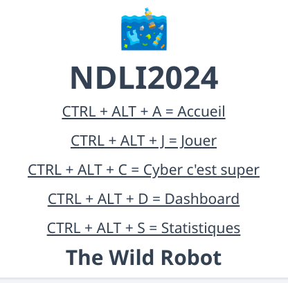
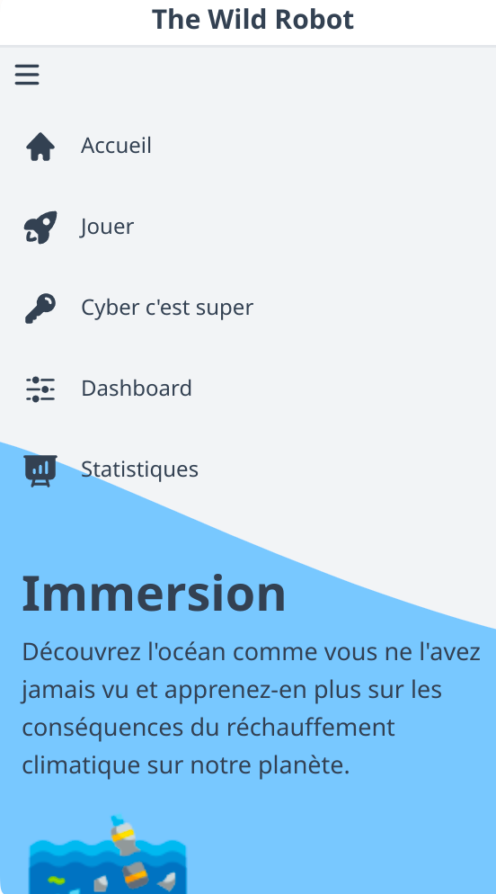
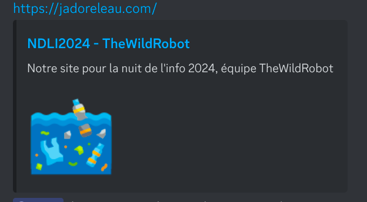
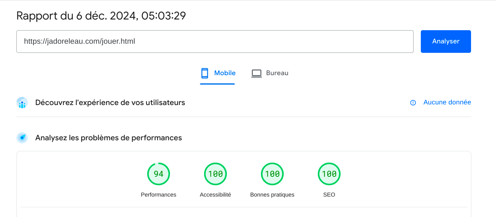

# NDLI 2024 TheWildRobot

Le défi principal du projet se trouve dans la page d'accueil, /index.html et la page /jouer.html qui permettent d'apprendre les similitudes entre les humains et les océans puis de vérifier ses connaissances sur le quiz.

## Accessibilité (défi L’accessibilité au cœur du développement : relevez le défi !)

-   [x] Les images ont une balise alt cohérente
-   [x] Arias et labels sont utilisés correctement
-   [x] Les couleurs ont un contraste suffisant (vérifié sur https://dequeuniversity.com/rules/axe/4.10/color-contrast)
-   [x] Le site est navigable au clavier (voir raccourcis clavier)
    -   []
-   [x] Le site est responsive sur tout type d'écran
    -   []
-   [x] Les sections et titres sont cohérents (vérifié sur google page speed insights, section SEO et accessibilité)
-   [x] Ajout des métadatas pour les vignettes du site (Open Graph & Twitter Card)
    -   []

#### Vérifications

Google page speed insights

[]

#### Comment naviguer au clavier ?

-   [x] Tabulation
-   [x] Flèches pour scroll
-   [x] Touche entrée pour valider
-   [x] Raccourcis clavier

Raccourcis clavier :

-   CTRL + ALT + A : Accueil
-   CTRL + ALT + J : Jouer
-   CTRL + ALT + D : Dashboard
-   CTRL + ALT + C : Cyber

## Dashboard (défi Mets tes binocles!)

On a choisi d'utiliser la combinaison de Grafana et Prometheus pour le dashboard puisqu'elle est très simple à mettre en place avec Docker. Elle est aussi très populaire dans le milieu de l'open source.
Le dashboard a été fait précisément pour notre application. Il permet de voir les statistiques de l'application en temps réel.

On ajoute à cela Uptime Kuma, qui permet d'avoir un système d'alerte lors de pannes. Très simple à mettre en place avec Docker.

-   [x] [Dashboard](https://dash.jadoreleau.com/d/ce6270f3b0xdsf/main-dash?orgId=1&from=now-15m) Surveillance CPU, données, etc.
-   [x] [Uptime](https://uptime.jadoreleau.com/dashboard/1) Surveillance temps de réponse, statut, certificats.

Pour les deux services :

-   **Utilisateur** : admin
-   **Mot de passe** : ZVWE?S#2'8Hy3x.

## Enquête sur les Données : Devenez un Sherlock des Statistiques ! (défi Enquête sur les données)

1. **Documentation** : La documentation claire facilite la prise en main et l'utilisation sans confusion.
2. **Présentation** : La présentation simple et épurée rend la visualisation des données directe et facile à comprendre.
3. **Implémentation Technique** : L'API bien structurée et performante assure une intégration fluide et une fonctionnalité fiable.
4. **Pertinence des Données** : Les statistiques précises et pertinentes permettent des analyses détaillées et pertinentes pour les utilisateurs.
5. **Bonus Sécurisation** : La sécurisation des endpoints garantit une protection des données sensibles contre les accès non autorisés.
6. **Bonus Performance** : L'utilisation de la mise en cache optimise les performances et réduit les temps de réponse pour des analyses rapides.
7. **Bonus Innovation** : L'usage innovant de l'IA pour des analyses avancées offre des perspectives uniques sur les comportements des utilisateurs.
8. **Fiabilité** : La robustesse et la stabilité de l'application sont assurées par des tests réguliers et une gestion efficace des erreurs.

-   [x] [Plausible](https://plausible.jadoreleau.com) Surveillance des visites, pages vues, etc.

Identifiants :

-   **Utilisateur** : admin@jadoreleau.com
-   **Mot de passe** : ZVWE?S#2'8Hy3x.
